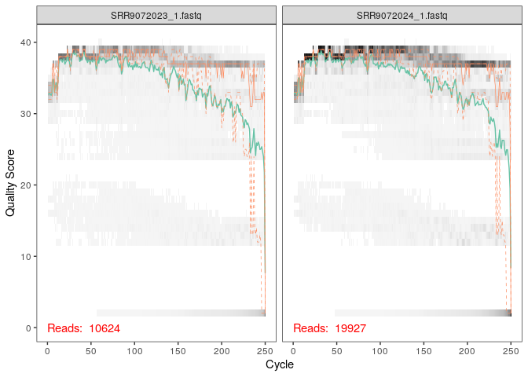

cc3\_ecog2
================

  - [Dada2](#dada2)
  - [Learn the Error Rates](#learn-the-error-rates)
  - [Construct sequence table and remove
    chimeras](#construct-sequence-table-and-remove-chimeras)
  - [Remove chimeras](#remove-chimeras)
  - [Track reads through the
    pipeline](#track-reads-through-the-pipeline)
  - [Assign taxonomy](#assign-taxonomy)
  - [Combine data into a phyloseq
    object](#combine-data-into-a-phyloseq-object)
  - [Analyse des coordonnées principales (PCoA) en utilisant UniFrad non
    pondéré de la diversité bêta et les distances métriques de
    Bray-Curtis de diversité
    bêta.](#analyse-des-coordonnées-principales-pcoa-en-utilisant-unifrad-non-pondéré-de-la-diversité-bêta-et-les-distances-métriques-de-bray-curtis-de-diversité-bêta.)
      - [erreur qu’on a pas pu résoudre](#erreur-quon-a-pas-pu-résoudre)
      - [erreur N°2](#erreur-n2)

\#Introduction L’objectif de cette étude est de révéler le microbiome
tumoral de cohortes indépendantes de patients attiends de PDAC à partir
des deux établissements de soins differents(MADCC et JHH) en étudiant
les survivants à long terme et à court terme pour étudier et mieux
comprendre les influences liées à l’hôte qui pourraient guider cette
survie à long terme inhabituelle.

# Dada2

``` r
library("rmarkdown")
library("knitr")
```

``` r
library(dada2)
library(ggplot2)
library(gridExtra)
library(phyloseq)
library(DECIPHER)
library(phangorn)
library(Biostrings)
```

``` r
miseq_path <- "~/CC3-article/ech_article_cc3" # CHANGE ME to the directory containing the fastq files after unzipping.
list.files(miseq_path)
```

    ##   [1] "filtered"           "SRR9072023_1.fastq" "SRR9072023_2.fastq"
    ##   [4] "SRR9072024_1.fastq" "SRR9072024_2.fastq" "SRR9072025_1.fastq"
    ##   [7] "SRR9072025_2.fastq" "SRR9072026_1.fastq" "SRR9072026_2.fastq"
    ##  [10] "SRR9072027_1.fastq" "SRR9072027_2.fastq" "SRR9072028_1.fastq"
    ##  [13] "SRR9072028_2.fastq" "SRR9072029_1.fastq" "SRR9072029_2.fastq"
    ##  [16] "SRR9072030_1.fastq" "SRR9072030_2.fastq" "SRR9072031_1.fastq"
    ##  [19] "SRR9072031_2.fastq" "SRR9072032_1.fastq" "SRR9072032_2.fastq"
    ##  [22] "SRR9072033_1.fastq" "SRR9072033_2.fastq" "SRR9072034_1.fastq"
    ##  [25] "SRR9072034_2.fastq" "SRR9072035_1.fastq" "SRR9072035_2.fastq"
    ##  [28] "SRR9072036_1.fastq" "SRR9072036_2.fastq" "SRR9072037_1.fastq"
    ##  [31] "SRR9072037_2.fastq" "SRR9072038_1.fastq" "SRR9072038_2.fastq"
    ##  [34] "SRR9072039_1.fastq" "SRR9072039_2.fastq" "SRR9072040_1.fastq"
    ##  [37] "SRR9072040_2.fastq" "SRR9072041_1.fastq" "SRR9072041_2.fastq"
    ##  [40] "SRR9072042_1.fastq" "SRR9072042_2.fastq" "SRR9072043_1.fastq"
    ##  [43] "SRR9072043_2.fastq" "SRR9072044_1.fastq" "SRR9072044_2.fastq"
    ##  [46] "SRR9072045_1.fastq" "SRR9072045_2.fastq" "SRR9072046_1.fastq"
    ##  [49] "SRR9072046_2.fastq" "SRR9072047_1.fastq" "SRR9072047_2.fastq"
    ##  [52] "SRR9072048_1.fastq" "SRR9072048_2.fastq" "SRR9072049_1.fastq"
    ##  [55] "SRR9072049_2.fastq" "SRR9072050_1.fastq" "SRR9072050_2.fastq"
    ##  [58] "SRR9072051_1.fastq" "SRR9072051_2.fastq" "SRR9072052_1.fastq"
    ##  [61] "SRR9072052_2.fastq" "SRR9072053_1.fastq" "SRR9072053_2.fastq"
    ##  [64] "SRR9072054_1.fastq" "SRR9072054_2.fastq" "SRR9072055_1.fastq"
    ##  [67] "SRR9072055_2.fastq" "SRR9072056_1.fastq" "SRR9072056_2.fastq"
    ##  [70] "SRR9072057_1.fastq" "SRR9072057_2.fastq" "SRR9072058_1.fastq"
    ##  [73] "SRR9072058_2.fastq" "SRR9072059_1.fastq" "SRR9072059_2.fastq"
    ##  [76] "SRR9072060_1.fastq" "SRR9072060_2.fastq" "SRR9072061_1.fastq"
    ##  [79] "SRR9072061_2.fastq" "SRR9072062_1.fastq" "SRR9072062_2.fastq"
    ##  [82] "SRR9072063_1.fastq" "SRR9072063_2.fastq" "SRR9072064_1.fastq"
    ##  [85] "SRR9072064_2.fastq" "SRR9072065_1.fastq" "SRR9072065_2.fastq"
    ##  [88] "SRR9072066_1.fastq" "SRR9072066_2.fastq" "SRR9072067_1.fastq"
    ##  [91] "SRR9072067_2.fastq" "SRR9072068_1.fastq" "SRR9072068_2.fastq"
    ##  [94] "SRR9072069_1.fastq" "SRR9072069_2.fastq" "SRR9072070_1.fastq"
    ##  [97] "SRR9072070_2.fastq" "SRR9072071_1.fastq" "SRR9072071_2.fastq"
    ## [100] "SRR9072072_1.fastq" "SRR9072072_2.fastq" "SRR9072073_1.fastq"
    ## [103] "SRR9072073_2.fastq" "SRR9072074_1.fastq" "SRR9072074_2.fastq"
    ## [106] "SRR9072075_1.fastq" "SRR9072075_2.fastq" "SRR9072076_1.fastq"
    ## [109] "SRR9072076_2.fastq" "SRR9072077_1.fastq" "SRR9072077_2.fastq"
    ## [112] "SRR9072078_1.fastq" "SRR9072078_2.fastq" "SRR9072079_1.fastq"
    ## [115] "SRR9072079_2.fastq" "SRR9072080_1.fastq" "SRR9072080_2.fastq"
    ## [118] "SRR9072081_1.fastq" "SRR9072081_2.fastq" "SRR9072082_1.fastq"
    ## [121] "SRR9072082_2.fastq" "SRR9072083_1.fastq" "SRR9072083_2.fastq"
    ## [124] "SRR9072084_1.fastq" "SRR9072084_2.fastq" "SRR9072085_1.fastq"
    ## [127] "SRR9072085_2.fastq" "SRR9072086_1.fastq" "SRR9072086_2.fastq"
    ## [130] "SRR9072087_1.fastq" "SRR9072087_2.fastq" "SRR9072088_1.fastq"
    ## [133] "SRR9072088_2.fastq" "SRR9072089_1.fastq" "SRR9072089_2.fastq"
    ## [136] "SRR9072090_1.fastq" "SRR9072090_2.fastq"

\#decompress several fastq.gz files into one single file par unzip

\#les echantillions

``` r
fnFs <- sort(list.files(miseq_path, pattern="_1.fastq", full.names = TRUE))
fnRs <- sort(list.files(miseq_path, pattern="_2.fastq", full.names = TRUE))
sample.names <- sapply(strsplit(basename(fnFs), "_"), `[`, 1)
sample.names
```

    ##  [1] "SRR9072023" "SRR9072024" "SRR9072025" "SRR9072026" "SRR9072027"
    ##  [6] "SRR9072028" "SRR9072029" "SRR9072030" "SRR9072031" "SRR9072032"
    ## [11] "SRR9072033" "SRR9072034" "SRR9072035" "SRR9072036" "SRR9072037"
    ## [16] "SRR9072038" "SRR9072039" "SRR9072040" "SRR9072041" "SRR9072042"
    ## [21] "SRR9072043" "SRR9072044" "SRR9072045" "SRR9072046" "SRR9072047"
    ## [26] "SRR9072048" "SRR9072049" "SRR9072050" "SRR9072051" "SRR9072052"
    ## [31] "SRR9072053" "SRR9072054" "SRR9072055" "SRR9072056" "SRR9072057"
    ## [36] "SRR9072058" "SRR9072059" "SRR9072060" "SRR9072061" "SRR9072062"
    ## [41] "SRR9072063" "SRR9072064" "SRR9072065" "SRR9072066" "SRR9072067"
    ## [46] "SRR9072068" "SRR9072069" "SRR9072070" "SRR9072071" "SRR9072072"
    ## [51] "SRR9072073" "SRR9072074" "SRR9072075" "SRR9072076" "SRR9072077"
    ## [56] "SRR9072078" "SRR9072079" "SRR9072080" "SRR9072081" "SRR9072082"
    ## [61] "SRR9072083" "SRR9072084" "SRR9072085" "SRR9072086" "SRR9072087"
    ## [66] "SRR9072088" "SRR9072089" "SRR9072090"

\#Visualiser les profils de qualité des lectures avant:

``` r
plotQualityProfile(fnFs[1:2])
```

<!-- -->

\#visualiser le profil de qualité des lectures inversées

``` r
plotQualityProfile(fnRs[1:2])
```

<!-- -->

\#Filtrer et couper

``` r
# Place filtered files in filtered/ subdirectory
filtFs <- file.path(miseq_path, "filtered", paste0(sample.names, "_F_filt.fastq.gz"))
filtRs <- file.path(miseq_path, "filtered", paste0(sample.names, "_R_filt.fastq.gz"))
names(filtFs) <- sample.names
names(filtRs) <- sample.names
```

``` r
out <- filterAndTrim(fnFs, filtFs, fnRs, filtRs, truncLen=c(240, 100), maxN=0, maxEE=c(2,2), truncQ=2, rm.phix=TRUE, compress=TRUE, multithread=TRUE) # On Windows set multithread=FALSE
head(out)
```

    ##                    reads.in reads.out
    ## SRR9072023_1.fastq    10624      8419
    ## SRR9072024_1.fastq    19927     15911
    ## SRR9072025_1.fastq    20768     16921
    ## SRR9072026_1.fastq    40600     32810
    ## SRR9072027_1.fastq    36908     29847
    ## SRR9072028_1.fastq    13154     10393

``` r
derepFs <- derepFastq(filtFs, verbose=TRUE)
derepRs <- derepFastq(filtRs, verbose=TRUE)
# Name the derep-class objects by the sample names
names(derepFs) <- sample.names
names(derepRs) <- sample.names
```

# Learn the Error Rates

``` r
errF <- learnErrors(filtFs, multithread=TRUE)
```

    ## 102540480 total bases in 427252 reads from 12 samples will be used for learning the error rates.

``` r
errR <- learnErrors(filtRs, multithread=TRUE)
```

    ## 103687600 total bases in 1036876 reads from 26 samples will be used for learning the error rates.

\#Apprener les taux d’erreur

``` r
plotErrors(errF, nominalQ=TRUE)
```

<!-- -->

``` r
plotErrors(errR, nominalQ=TRUE)
```

<!-- -->

``` r
dadaFs <- dada(derepFs, err=errF, multithread=TRUE)
```

    ## Sample 1 - 8419 reads in 1797 unique sequences.
    ## Sample 2 - 15911 reads in 3051 unique sequences.
    ## Sample 3 - 16921 reads in 3307 unique sequences.
    ## Sample 4 - 32810 reads in 6157 unique sequences.
    ## Sample 5 - 29847 reads in 5708 unique sequences.
    ## Sample 6 - 10393 reads in 2130 unique sequences.
    ## Sample 7 - 39808 reads in 8108 unique sequences.
    ## Sample 8 - 97094 reads in 9751 unique sequences.
    ## Sample 9 - 34946 reads in 6977 unique sequences.
    ## Sample 10 - 51494 reads in 10439 unique sequences.
    ## Sample 11 - 50710 reads in 9817 unique sequences.
    ## Sample 12 - 38899 reads in 8137 unique sequences.
    ## Sample 13 - 8467 reads in 1925 unique sequences.
    ## Sample 14 - 25160 reads in 5125 unique sequences.
    ## Sample 15 - 47974 reads in 9212 unique sequences.
    ## Sample 16 - 44054 reads in 8357 unique sequences.
    ## Sample 17 - 81967 reads in 15447 unique sequences.
    ## Sample 18 - 94056 reads in 14759 unique sequences.
    ## Sample 19 - 9975 reads in 2108 unique sequences.
    ## Sample 20 - 12349 reads in 2399 unique sequences.
    ## Sample 21 - 75634 reads in 13524 unique sequences.
    ## Sample 22 - 74101 reads in 13020 unique sequences.
    ## Sample 23 - 7586 reads in 1594 unique sequences.
    ## Sample 24 - 15338 reads in 2916 unique sequences.
    ## Sample 25 - 31298 reads in 6729 unique sequences.
    ## Sample 26 - 81665 reads in 17226 unique sequences.
    ## Sample 27 - 10129 reads in 1896 unique sequences.
    ## Sample 28 - 15229 reads in 3021 unique sequences.
    ## Sample 29 - 6932 reads in 1167 unique sequences.
    ## Sample 30 - 54292 reads in 10840 unique sequences.
    ## Sample 31 - 41138 reads in 7467 unique sequences.
    ## Sample 32 - 52384 reads in 8025 unique sequences.
    ## Sample 33 - 10912 reads in 2194 unique sequences.
    ## Sample 34 - 23037 reads in 4847 unique sequences.
    ## Sample 35 - 35348 reads in 6668 unique sequences.
    ## Sample 36 - 59574 reads in 10812 unique sequences.
    ## Sample 37 - 17708 reads in 3740 unique sequences.
    ## Sample 38 - 3758 reads in 578 unique sequences.
    ## Sample 39 - 31355 reads in 6726 unique sequences.
    ## Sample 40 - 51565 reads in 9599 unique sequences.
    ## Sample 41 - 21816 reads in 4353 unique sequences.
    ## Sample 42 - 53295 reads in 6117 unique sequences.
    ## Sample 43 - 55157 reads in 7749 unique sequences.
    ## Sample 44 - 56832 reads in 10735 unique sequences.
    ## Sample 45 - 30386 reads in 5848 unique sequences.
    ## Sample 46 - 6366 reads in 1194 unique sequences.
    ## Sample 47 - 10289 reads in 1966 unique sequences.
    ## Sample 48 - 7656 reads in 1401 unique sequences.
    ## Sample 49 - 10239 reads in 1963 unique sequences.
    ## Sample 50 - 7757 reads in 1612 unique sequences.
    ## Sample 51 - 47931 reads in 9581 unique sequences.
    ## Sample 52 - 1247 reads in 255 unique sequences.
    ## Sample 53 - 5340 reads in 1078 unique sequences.
    ## Sample 54 - 6862 reads in 1435 unique sequences.
    ## Sample 55 - 74995 reads in 7708 unique sequences.
    ## Sample 56 - 52360 reads in 9504 unique sequences.
    ## Sample 57 - 35260 reads in 7759 unique sequences.
    ## Sample 58 - 934 reads in 227 unique sequences.
    ## Sample 59 - 65955 reads in 12922 unique sequences.
    ## Sample 60 - 48046 reads in 9379 unique sequences.
    ## Sample 61 - 9037 reads in 2354 unique sequences.
    ## Sample 62 - 59213 reads in 11688 unique sequences.
    ## Sample 63 - 23218 reads in 4438 unique sequences.
    ## Sample 64 - 58259 reads in 11898 unique sequences.
    ## Sample 65 - 51823 reads in 9856 unique sequences.
    ## Sample 66 - 17929 reads in 3777 unique sequences.
    ## Sample 67 - 10652 reads in 1951 unique sequences.
    ## Sample 68 - 23631 reads in 3153 unique sequences.

``` r
dadaRs <- dada(derepRs, err=errR, multithread=TRUE)
```

    ## Sample 1 - 8419 reads in 792 unique sequences.
    ## Sample 2 - 15911 reads in 1598 unique sequences.
    ## Sample 3 - 16921 reads in 1527 unique sequences.
    ## Sample 4 - 32810 reads in 3197 unique sequences.
    ## Sample 5 - 29847 reads in 2602 unique sequences.
    ## Sample 6 - 10393 reads in 1058 unique sequences.
    ## Sample 7 - 39808 reads in 3580 unique sequences.
    ## Sample 8 - 97094 reads in 4515 unique sequences.
    ## Sample 9 - 34946 reads in 2754 unique sequences.
    ## Sample 10 - 51494 reads in 4860 unique sequences.
    ## Sample 11 - 50710 reads in 4669 unique sequences.
    ## Sample 12 - 38899 reads in 3708 unique sequences.
    ## Sample 13 - 8467 reads in 869 unique sequences.
    ## Sample 14 - 25160 reads in 2263 unique sequences.
    ## Sample 15 - 47974 reads in 3492 unique sequences.
    ## Sample 16 - 44054 reads in 4112 unique sequences.
    ## Sample 17 - 81967 reads in 5869 unique sequences.
    ## Sample 18 - 94056 reads in 4277 unique sequences.
    ## Sample 19 - 9975 reads in 831 unique sequences.
    ## Sample 20 - 12349 reads in 895 unique sequences.
    ## Sample 21 - 75634 reads in 5417 unique sequences.
    ## Sample 22 - 74101 reads in 5975 unique sequences.
    ## Sample 23 - 7586 reads in 719 unique sequences.
    ## Sample 24 - 15338 reads in 1556 unique sequences.
    ## Sample 25 - 31298 reads in 2115 unique sequences.
    ## Sample 26 - 81665 reads in 5694 unique sequences.
    ## Sample 27 - 10129 reads in 883 unique sequences.
    ## Sample 28 - 15229 reads in 1339 unique sequences.
    ## Sample 29 - 6932 reads in 543 unique sequences.
    ## Sample 30 - 54292 reads in 4051 unique sequences.
    ## Sample 31 - 41138 reads in 3125 unique sequences.
    ## Sample 32 - 52384 reads in 3929 unique sequences.
    ## Sample 33 - 10912 reads in 1030 unique sequences.
    ## Sample 34 - 23037 reads in 2542 unique sequences.
    ## Sample 35 - 35348 reads in 2624 unique sequences.
    ## Sample 36 - 59574 reads in 4364 unique sequences.
    ## Sample 37 - 17708 reads in 1675 unique sequences.
    ## Sample 38 - 3758 reads in 345 unique sequences.
    ## Sample 39 - 31355 reads in 2442 unique sequences.
    ## Sample 40 - 51565 reads in 4049 unique sequences.
    ## Sample 41 - 21816 reads in 1939 unique sequences.
    ## Sample 42 - 53295 reads in 2141 unique sequences.
    ## Sample 43 - 55157 reads in 2862 unique sequences.
    ## Sample 44 - 56832 reads in 2810 unique sequences.
    ## Sample 45 - 30386 reads in 2926 unique sequences.
    ## Sample 46 - 6366 reads in 894 unique sequences.
    ## Sample 47 - 10289 reads in 931 unique sequences.
    ## Sample 48 - 7656 reads in 757 unique sequences.
    ## Sample 49 - 10239 reads in 1016 unique sequences.
    ## Sample 50 - 7757 reads in 779 unique sequences.
    ## Sample 51 - 47931 reads in 4399 unique sequences.
    ## Sample 52 - 1247 reads in 137 unique sequences.
    ## Sample 53 - 5340 reads in 527 unique sequences.
    ## Sample 54 - 6862 reads in 803 unique sequences.
    ## Sample 55 - 74995 reads in 3815 unique sequences.
    ## Sample 56 - 52360 reads in 3956 unique sequences.
    ## Sample 57 - 35260 reads in 2643 unique sequences.
    ## Sample 58 - 934 reads in 120 unique sequences.
    ## Sample 59 - 65955 reads in 3751 unique sequences.
    ## Sample 60 - 48046 reads in 3584 unique sequences.
    ## Sample 61 - 9037 reads in 857 unique sequences.
    ## Sample 62 - 59213 reads in 4936 unique sequences.
    ## Sample 63 - 23218 reads in 2114 unique sequences.
    ## Sample 64 - 58259 reads in 5756 unique sequences.
    ## Sample 65 - 51823 reads in 2275 unique sequences.
    ## Sample 66 - 17929 reads in 1365 unique sequences.
    ## Sample 67 - 10652 reads in 893 unique sequences.
    ## Sample 68 - 23631 reads in 1495 unique sequences.

``` r
dadaFs[[1]]
```

    ## dada-class: object describing DADA2 denoising results
    ## 32 sequence variants were inferred from 1797 input unique sequences.
    ## Key parameters: OMEGA_A = 1e-40, OMEGA_C = 1e-40, BAND_SIZE = 16

# Construct sequence table and remove chimeras

``` r
mergers <- mergePairs(dadaFs, derepFs, dadaRs, derepRs)
# Inspect the merger data.frame from the first sample
head(mergers[[1]])
```

    ##                                                                                                                                                                                                                                                        sequence
    ## 1 TACGTAGGTGGCAAGCGTTATCCGGAATTATTGGGCGTAAAGCGCGCGTAGGCGGTTTTTTAAGTCTGATGTGAAAGCCCACGGCTCAACCGTGGAGGGTCATTGGAAACTGGAAAACTTGAGTGCAGAAGAGGAAAGTGGAATTCCATGTGTAGCGGTGAAATGCGCAGAGATATGGAGGAACACCAGTGGCGAAGGCGACTTTCTGGTCTGTAACTGACGCTGATGTGCGAAAGCGTGGGGATCAAACAGG
    ## 2 TACGGAGGGTGCAAGCGTTAATCGGAATTACTGGGCGTAAAGCGCACGCAGGCGGTTTGTTAAGTCAGATGTGAAATCCCCGGGCTCAACCTGGGAACTGCATCTGATACTGGCAAGCTTGAGTCTCGTAGAGGGGGGTAGAATTCCAGGTGTAGCGGTGAAATGCGTAGAGATCTGGAGGAATACCGGTGGCGAAGGCGGCCCCCTGGACGAAGACTGACGCTCAGGTGCGAAAGCGTGGGGAGCAAACAGG
    ## 3 TACGGAGGGTGCAAGCGTTAATCGGAATTACTGGGCGTAAAGCGCACGCAGGCGGTTTGTCAAGTCGGATGTGAAATCCCCGGGCTTAACCTGGGAACTGCATTCGAAACTGGCAAGCTAGAGTCTCGTAGAGGGGGGTAGAATTCCAGGTGTAGCGGTGAAATGCGTAGAGATCTGGAGGAATACCGGTGGCGAAGGCGGCCCCCTGGACGAAGACTGACGCTCAGGTGCGAAAGCGTGGGGAGCAAACAGG
    ## 4 GACAGAGGATGCAAGCGTTATCCGGAATGATTGGGCGTAAAGCGTCTGTAGGTGGCTTTTCAAGTCCGCCGTCAAATCCCAGGGCTCAACCCTGGACAGGCGGTGGAAACTACCAAGCTGGAGTACGGTAGGGGCAGAGGGAATTTCCGGTGGAGCGGTGAAATGCATTGAGATCGGAAAGAACACCAACGGCGAAAGCACTCTGCTGGGCCGACACTGACACTGAGAGACGAAAGCTAGGGGAGCAAATGGG
    ## 5 TACGTAGGGCGCGAGCGTTGTCCGGATTTATTGGGCGTAAAGAGCTCGTAGGTGGTTCGTCGCGTCTGTCGTGAAAGCCAGCAGCTTAACTGTTGGTCTGCGGTGGGTACGGGCGGGCTTGAGTGCGGTAGGGGTGACTGGAATTCCTGGTGTAGCGGTGGAATGCGCAGATATCAGGAGGAACACCGATGGCGAAGGCAGGTCACTGGGCCGTTACTGACACTGAGGAGCGAAAGCGTGGGGAGCGAACAGG
    ## 6 TACGTAGGGGGCAAGCGTTATCCGGATTTACTGGGTGTAAAGGGAGCGTAGACGGTTAAGCAAGTCTGGAGTGAAAGGCGGGGGCTCAACCCCCGGACTGCTCTGGAAACTGTGTAACTAGAGTGCAGGAGGGGTAAGTGGAATTCCTAGTGTAGCGGTGAAATGCGTAGATATTAGGAGGAACACCAGTGGCGAAGGCGGCTTACTGGACTGTAACTGACGTTGAGGCTCGAAAGCGTGGGGAGCAAACAGG
    ##   abundance forward reverse nmatch nmismatch nindel prefer accept
    ## 1      1489       1       2     87         0      0      2   TRUE
    ## 2      1148       2       1     87         0      0      2   TRUE
    ## 3       755       3       1     87         0      0      2   TRUE
    ## 4       559       5       3     87         0      0      2   TRUE
    ## 5       551       4       4     87         0      0      2   TRUE
    ## 6       368       7       6     87         0      0      2   TRUE

``` r
seqtabAll <- makeSequenceTable(mergers[!grepl("Mock", names(mergers))])
table(nchar(getSequences(seqtabAll)))
```

    ## 
    ##  240  241  248  250  251  252  253  254  255  257  260  273  280  289  303  314 
    ## 1286    1    1    8   24  289 2484  122    9    2    1    1    1    1    2    1

# Remove chimeras

``` r
seqtabNoC <- removeBimeraDenovo(seqtabAll)
```

# Track reads through the pipeline

``` r
getN <- function(x) sum(getUniques(x))
track <- cbind(out, sapply(dadaFs, getN), sapply(dadaRs, getN), sapply(mergers, getN), rowSums(seqtabNoC))
# If processing a single sample, remove the sapply calls: e.g. replace sapply(dadaFs, getN) with getN(dadaFs)
colnames(track) <- c("input", "filtered", "denoisedF", "denoisedR", "merged", "nonchim")
rownames(track) <- sample.names
head(track)
```

    ##            input filtered denoisedF denoisedR merged nonchim
    ## SRR9072023 10624     8419      8364      8403   8298    8298
    ## SRR9072024 19927    15911     15843     15850  15714   15629
    ## SRR9072025 20768    16921     16824     16882  16703   16560
    ## SRR9072026 40600    32810     32736     32626  32153   31404
    ## SRR9072027 36908    29847     29763     29734  29528   29523
    ## SRR9072028 13154    10393     10360     10358  10290   10201

# Assign taxonomy

``` r
taxa <- assignTaxonomy(seqtabNoC, "~/CC3-article/silva_nr99_v138_train_set.fa.gz", multithread=TRUE)
```

``` r
taxa <- addSpecies(taxa, "~/CC3-article/silva_species_assignment_v138.fa.gz")
```

``` r
taxa.print <- taxa # Removing sequence rownames for display only
rownames(taxa.print) <- NULL
head(taxa.print)
```

    ##      Kingdom    Phylum             Class                 Order              
    ## [1,] "Bacteria" "Cyanobacteria"    "Cyanobacteriia"      "Chloroplast"      
    ## [2,] "Bacteria" "Proteobacteria"   "Gammaproteobacteria" "Enterobacterales" 
    ## [3,] "Bacteria" "Firmicutes"       "Bacilli"             "Staphylococcales" 
    ## [4,] "Bacteria" "Proteobacteria"   "Gammaproteobacteria" "Enterobacterales" 
    ## [5,] "Bacteria" "Actinobacteriota" "Actinobacteria"      "Corynebacteriales"
    ## [6,] "Bacteria" "Cyanobacteria"    "Cyanobacteriia"      "Chloroplast"      
    ##      Family               Genus                  Species         
    ## [1,] NA                   NA                     NA              
    ## [2,] NA                   NA                     NA              
    ## [3,] "Staphylococcaceae"  "Staphylococcus"       NA              
    ## [4,] "Enterobacteriaceae" "Escherichia-Shigella" NA              
    ## [5,] "Corynebacteriaceae" "Lawsonella"           "clevelandensis"
    ## [6,] NA                   NA                     NA

# Combine data into a phyloseq object

\#metada-table

``` r
samdf <-read.table('~/CC2_Ecog2-FZM/samdf.csv', sep=',', header=TRUE, row.names=1)
```

``` r
ps <- phyloseq(otu_table(seqtabNoC, taxa_are_rows=FALSE), 
               sample_data(samdf), 
               tax_table(taxa))
ps
```

    ## phyloseq-class experiment-level object
    ## otu_table()   OTU Table:         [ 3678 taxa and 68 samples ]
    ## sample_data() Sample Data:       [ 68 samples by 37 sample variables ]
    ## tax_table()   Taxonomy Table:    [ 3678 taxa by 7 taxonomic ranks ]

\#Visualisez la diversité alpha par (Shannon et Simpson réciproque) dans
les cohortes MDACC et JHH de patients PDAC.

``` r
plot_richness(ps, x="cohort", measures=c("Observed_species", "Shannon", "Simpson"), color="survival_status")
```

<!-- -->

Cette figure montre les résultats de la mesure de la diversité
microbienne de la tumeur des 68 tumeurs PDAC réséquées chirurgicalement
(36 LTS et 32 STS)en utilisant différentes méthodologies ( Indices de
Shannon et Simpson) et ils ont constaté que la diversité alpha du
microbiome tumoral, définie comme le nombre d’espèces présentes dans
chaque échantillon de tumeur, était significativement plus élevée chez
les patients LTS que chez STS dans la cohorte découverte MDACC ( p
\<0,0005, p \<0,0005 et p\<0,05, pour chaque indice de diversité alpha,
respectivement) et la cohorte de validation JHH ( p \<0,005, p \<0,005
et p \<0,005, pour chaque indice de diversité alpha, respectivement),
donc on peut conclue qu’il existe une relation entre la diversité
microbienne de la tumeur PDAC et la survie globale (SG) dans la cohorte.

\#taxonomie filtring

``` r
rank_names(ps)
```

    ## [1] "Kingdom" "Phylum"  "Class"   "Order"   "Family"  "Genus"   "Species"

``` r
table(tax_table(ps)[, "Phylum"], exclude = NULL)
```

    ## 
    ##  Abditibacteriota   Acidobacteriota  Actinobacteriota    Armatimonadota 
    ##                 2                17               469                 4 
    ##      Bacteroidota  Bdellovibrionota  Campilobacterota       Chloroflexi 
    ##               360                11                 8                12 
    ##     Cyanobacteria      Deinococcota      Dependentiae  Desulfobacterota 
    ##                59                 9                 2                 6 
    ##     Euryarchaeota    Fibrobacterota        Firmicutes    Fusobacteriota 
    ##                 3                 3               776                17 
    ##   Gemmatimonadota       Myxococcota   Patescibacteria   Planctomycetota 
    ##                13                17                 4                16 
    ##    Proteobacteria     Spirochaetota      Synergistota Verrucomicrobiota 
    ##              1722                 1                 8                37 
    ##              <NA> 
    ##               102

``` r
ps <- subset_taxa(ps, !is.na(Phylum) & !Phylum %in% c("", "uncharacterized"))
```

``` r
# Compute prevalence of each feature, store as data.frame
prevdf = apply(X = otu_table(ps),
               MARGIN = ifelse(taxa_are_rows(ps), yes = 1, no = 2),
               FUN = function(x){sum(x > 0)})
# Add taxonomy and total read counts to this data.frame
prevdf = data.frame(Prevalence = prevdf,
                    TotalAbundance = taxa_sums(ps),
                    tax_table(ps))
```

``` r
plyr::ddply(prevdf, "Phylum", function(df1){cbind(mean(df1$Prevalence),sum(df1$Prevalence))})
```

    ##               Phylum        1    2
    ## 1   Abditibacteriota 1.000000    2
    ## 2    Acidobacteriota 1.117647   19
    ## 3   Actinobacteriota 2.334755 1095
    ## 4     Armatimonadota 1.000000    4
    ## 5       Bacteroidota 1.597222  575
    ## 6   Bdellovibrionota 1.090909   12
    ## 7   Campilobacterota 1.125000    9
    ## 8        Chloroflexi 1.250000   15
    ## 9      Cyanobacteria 2.016949  119
    ## 10      Deinococcota 1.444444   13
    ## 11      Dependentiae 1.000000    2
    ## 12  Desulfobacterota 1.500000    9
    ## 13     Euryarchaeota 1.000000    3
    ## 14    Fibrobacterota 1.000000    3
    ## 15        Firmicutes 2.206186 1712
    ## 16    Fusobacteriota 1.823529   31
    ## 17   Gemmatimonadota 1.000000   13
    ## 18       Myxococcota 1.176471   20
    ## 19   Patescibacteria 1.000000    4
    ## 20   Planctomycetota 1.062500   17
    ## 21    Proteobacteria 1.515679 2610
    ## 22     Spirochaetota 1.000000    1
    ## 23      Synergistota 1.000000    8
    ## 24 Verrucomicrobiota 1.351351   50

\#Prevalence Filtering

``` r
# Subset to the remaining phyla
prevdf1 = subset(prevdf, Phylum %in% get_taxa_unique(ps, "Phylum"))
ggplot(prevdf1, aes(TotalAbundance, Prevalence / nsamples(ps),color=Phylum)) +
  # Include a guess for parameter
  geom_hline(yintercept = 0.05, alpha = 0.5, linetype = 2) +  geom_point(size = 2, alpha = 0.7) +
  scale_x_log10() +  xlab("Total Abundance") + ylab("Prevalence [Frac. Samples]") +
  facet_wrap(~Phylum) + theme(legend.position="none")
```

<!-- -->

``` r
ggsave("pcoa.jpg", width = 250, height = 100, units = "mm")
```

``` r
pslog <- transform_sample_counts(ps, function(x) log(1 + x))
out.wuf.log <- ordinate(pslog, method = "PCoA", distance = "bray")
```

# Analyse des coordonnées principales (PCoA) en utilisant UniFrad non pondéré de la diversité bêta et les distances métriques de Bray-Curtis de diversité bêta.

``` r
evals <- out.wuf.log$values$Eigenvalues
plot_ordination(pslog, out.wuf.log, color = "survival_status", shape="cohort") +
  labs(col = "survival_status",shape= "cohort")
```

<!-- -->

Cette figure présente une Matrice PCoA de la diversité bêta, une
similarité entre les OTU de LTS et STS des deux échantillons car les
communautés sont relativement proches et que chaque couleur est présente
dans les deux échantillons ce qui est confirmé par l’indice Bray-Curtis
qui tend vers 0 et en fonction du temps de la survie des patients il n’y
a pas de différences significatives en les OTU des deux échantillons.

``` r
ggsave("pcoa.jpg", width = 150, height = 100, units = "mm")
```

\#Diagrammes à barres des niveaux taxonomiques de classe dans les
cohortes MDA et JHH de patients PDAC. L’abondance relative est tracée
pour chaque tumeur.

``` r
top20 <- names(sort(taxa_sums(ps), decreasing=TRUE))[1:20]
ps.top20 <- transform_sample_counts(ps, function(OTU) OTU/sum(OTU))
ps.top20 <- prune_taxa(top20, ps.top20)
plot_bar(ps.top20, x="echant", fill="Class") + facet_wrap(~cohort, scales="free_x")
```

<!-- --> A
partir de la figure des diagrammes en barres des niveaux taxonomiques de
classe dans les cohortes de patients atteints de PDAC, elle montre
l’abondance relative de 17 isolats de bactéries similaires au
microbiome tumoral PDAC LTS et la STS. L’abondance de
Gammaproteobacteria, Bacilli, Actinobacteria et les Clostridia, est
Importante dans les deux Echantillons (MDACC et JHH), ce qui indique que
les caractéristiques taxonomiques ne sont pas significativement
différenciées entre les deux cohorts.

\#LDA score computed from features differentially abundant between LTS
and STS. The criteria for feature selection is Log LDA Score \> 4

### erreur qu’on a pas pu résoudre

library(MASS) \# Fit the model model \<- lda(x,data = samdf) \# Make
predictions predictions \<- model %\>% predict(test.transformed) \#
Model accuracy mean(predictions\(class==test.transformed\)Species)
\#\#\#

la figure de LDA score presente une analyse pour la classification et la
comparaison à haute dimension, et ont constaté qu’il existe une
différence significative entre la dominance de la communauté
bactérienne entre LTS et STS. Les tumeurs LTS montrent principalement
des Alphaprotebacteria Sphingobacteria et Flavobacteria au niveau de la
classe. Au contraire, au niveau de la classe, Clostridium et Bacteroides
dominent les cas STS PDAC.

\#Heatmap of selected most differentially abundant features at the genus
level.

``` r
row.names(samdf) <- samdf$Name
```

``` r
samdf <- samdf[,2:20]
```

``` r
samdf_matrix <- data.matrix(samdf)
```

### erreur N°2

samdf\_heatmap \<- heatmap(samdf\_matrix, Rowv=“Class”,
Colv=“survival\_status”, col = cm.colors(256), scale=“column”,
margins=c(5,10), xlab = “survival\_status”, ylab = “Class”) \#\#\#

La carte thermique présente une ségrégation différentielle des
communautés taxonomiques en fonction de la survie des patients PDAC,
avec quoi la visualisation de la ségrégation différentielle des
communautés taxonomiques en fonction de la survie des patients PDAC. Les
LTS ont montré une dominance de trois genres : Pseudoxanthomonas et
Saccharopolyspora et Streptomyces, alors que les STS n’y ont pas de
détection d’un genre prédominant.

\#Conclusion

les résultats de cette recherche ont montré des caractéristiques
taxonomiques microbiens speciales dététctés chez les survivants du
cancer du pancréas à long terme par rapport aux patients qui ont une
courte survie, ce qui pourrait être utilisé pour pré-analyser la survie
de la PDAC chez l’homme, et afin de faire la métastase du microbiome
intestinal à longue durée de vie pour modifier le microbiome tumoral
chez les patients.
